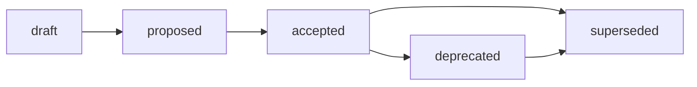

<!-- SPDX-License-Identifier: MIT -->

# Memory Governance

Concepts referenced (not vendored — see `THIRD_PARTY_NOTICES.md`): the
MIT-licensed [Microsoft Agent Governance
Toolkit](https://github.com/microsoft/agent-governance-toolkit) (policy
modes, memory-as-untrusted-input), the OWASP Agentic AI Top 10 (2026)
(memory poisoning as a named risk category), and NIST AI RMF's
Govern/Map/Measure/Manage functions. No code or text from any of these was
copied; this document restates the concepts in original prose for a
markdown-only, dependency-free template.

## Policy modes

Set in `.ai/hooks-config.json` under `memory.policyMode`. These are
procedural conventions in this template (there is no runtime to enforce
them) — an agent operating under this template follows them by instruction,
the same way it follows `.ai/rules/`.

| Mode | Behavior |
|------|----------|
| `strict` | Only `trust: reviewed` or `trust: authoritative` notes may be loaded into context. `unverified` notes are skipped entirely. |
| `permissive` | Any note may be loaded, but `unverified` notes must be flagged as such in the agent's response when used. |
| `audit` | Default. Same as `permissive`, plus every retrieval that includes an `unverified` note is itself worth a one-line episodic note recording what was loaded and why. |

## Trust levels

| Level | Meaning | Who sets it |
|-------|---------|-------------|
| `unverified` | Default for anything not yet reviewed. Safe to read, not safe to act on unattributed. | Anyone / any agent, at write time |
| `reviewed` | A human reviewer has read the note and confirmed it is accurate as of `updated`. | Human, at PR-merge time |
| `authoritative` | The single source of truth for a fact; supersedes any conflicting `unverified` or `reviewed` note. | Human, deliberately, sparingly |

An agent must never set its own note's `trust` above `unverified`. Promotion
requires a separate reviewed change.

## Classification

| Level | Meaning |
|-------|---------|
| `public` | Safe to appear in a public template, public repo, or public documentation. **The only level this template ships or accepts.** |
| `internal` | Safe within the organization; not for a public template. |
| `restricted` | Sensitive; requires access control this template does not implement. |

If a project forked from this template needs `internal` or `restricted`
content, that is a decision for the fork, made explicitly — do not silently
widen classification here.

## Promotion lifecycle

- **`draft`** — being written, not yet ready for review.
- **`proposed`** — ready for review; frontmatter and content are complete.
- **`accepted`** — reviewed and merged; `trust` moves to `reviewed` (or
  `authoritative` for the rare authoritative source) in the same change.
- **`deprecated`** — no longer recommended, but kept for history.
- **`superseded`** — replaced by a specific other note; fill `supersedes` on
  the new note and add a `links` pointer both ways.

This is the public MADR/Nygard ADR status vocabulary, applied uniformly
across all five memory types rather than only to decisions.

## Cross-type promotion

- **episodic -> semantic**: when an episodic note contains a durable fact or
  decision worth keeping past its `review_after` date, extract it into a new
  semantic note and link back with `links:`. Do not delete the episodic
  note; it remains the provenance trail.
- **procedural -> `.ai/skills/`**: once a procedural note has been followed
  successfully several times without correction, promote it to a full
  `SKILL.md` (see `.ai/SKILL-FORMAT.md`) and record the promotion in the
  note's `## Graduation Criteria` section.
- **parametric failure -> semantic**: every row in
  `parametric/register.md`'s failure log is a trigger to write or correct a
  semantic note, not merely to record that the model was wrong.

## Staleness sweep

Any note whose `review_after` date has passed should be treated as stale
context, not as current fact, until re-verified. The `memory-curator` skill
(`.ai/skills/memory-curator/SKILL.md`) runs a staleness sweep on request:
list notes past `review_after`, and for each, either bump `updated` +
`review_after` after re-confirming accuracy, or flag it `deprecated`.

## Prospective memory and GitHub Issues (optional)

`prospective/backlog.md` is a local markdown table and is always the source
of truth. A row **may** be mirrored to a GitHub Issue using
`.github/ISSUE_TEMPLATE/backlog-item.yml`; the mapping is:

| `backlog.md` column | GitHub Issue field |
|----------------------|----------------------|
| `title` | Issue title |
| `type` (`bug`, `feature`, `chore`, `roadmap`) | Label: `memory-type/<type>` |
| `priority` (`p0`-`p3`) | Label: `priority/<priority>` |
| `status` (`open`, `in-progress`, `blocked`, `done`) | Label: `status/<status>` (or issue closed for `done`) |
| `owner` | Assignee (if the GitHub username is known) |
| `issue` | Issue URL, written back into the row once created |

The sync is one-directional and manual in this template: an agent or human
creates the Issue from a row, then writes the resulting URL back into the
`issue` column. No webhook, GitHub Action, or bot account is required or
shipped. Teams that want two-way sync can build one later without changing
the row schema.
