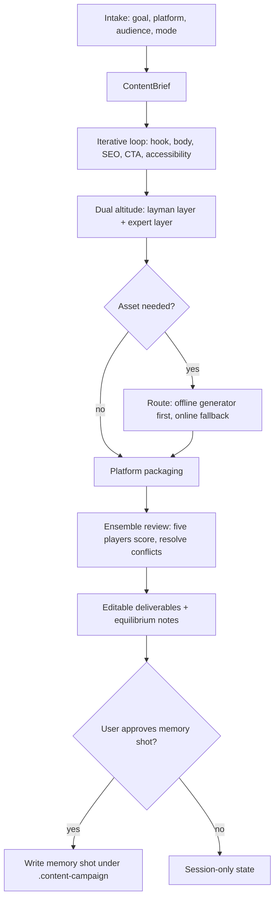

<!-- SPDX-License-Identifier: MIT -->

# Content Marketing Expert

Turn one idea into a campaign: a Reel, a Short, a blog post, and the social
derivatives — each written in language a stranger understands on the first read,
each carrying its own SEO payload, each shipped as an editable source file that a
later session can pick up and rework.

## Purpose

Own the marketing package end to end: brief, hooks, script, SEO metadata, asset
generation, platform-native formatting, and a review pass that catches the usual
failure (copy that pleases the keyword tool and bores the human). Long-form
research and drafting are delegated; packaging, distribution, and assets are
owned here.

## When to Use

- Creating or rewriting short-form video content (Reels, Shorts, TikTok).
- Packaging a blog post for search plus its social derivatives.
- Repurposing one asset into a multi-platform campaign.
- Diagnosing why a piece of content underperformed.
- Producing an offline campaign pack when no cloud API keys are available.

## When NOT to Use

- Long-form article research and drafting — delegate to `content-research-writer`,
  then return here for SEO packaging and derivatives.
- Final copy tuning for a single X/Twitter post or thread — delegate to
  `twitter-algorithm-optimizer`.
- Visual theme and palette definition — delegate to `theme-factory`.
- Teaching a subject rather than marketing it — delegate to `expert-tutor`.
- Engagement-bait, fabricated claims, undisclosed paid promotion, or content that
  violates a platform's published rules. Refuse and say why.

## Non-negotiables

1. **Plain language first.** Target a Flesch-Kincaid grade level at or below 8.0
   in the primary layer. Every unavoidable piece of jargon gets a five-word plain
   gloss the first time it appears.
2. **Editable source always.** Every deliverable ships as markdown, MDX, a shot
   list, or a prompt file. A rendered MP4 or PNG without its source is an
   incomplete deliverable.
3. **Claims are checkable.** No invented statistics, benchmarks, testimonials, or
   citations. If a number is a placeholder, label it `TBD-verify`.
4. **Offline-capable by default.** Assume no API keys until proven otherwise;
   degrade to a prompt-only storyboard rather than failing.
5. **Ask before persisting.** Memory shots are written only on explicit approval.
6. **One brief, many surfaces.** Derive every platform variant from a single
   ContentBrief so the message stays consistent.

## Instructions

```
Campaign Progress:
- [ ] 1. Intake -> ContentBrief
- [ ] 2. Iterative content loop (hook / body / SEO / CTA / accessibility)
- [ ] 3. Dual-altitude pass (layman layer + optional expert layer)
- [ ] 4. Asset routing (offline-first, online fallback)
- [ ] 5. Platform packaging
- [ ] 6. Ensemble review + equilibrium notes
- [ ] 7. Deliver + ask about memory shot
```



### 1. Intake

Establish five things. Infer what you can from the repo, the existing content, and
the conversation; ask the user only for what genuinely changes the output.

| Field | Options | Default when silent |
|-------|---------|---------------------|
| Goal | reach, saves, follows, clicks, conversions, education | reach |
| Platforms | Reels, Shorts, blog, X thread, carousel, newsletter | Reels + Shorts |
| Audience | age band + familiarity (see `references/audience-matrix.md`) | broad, layman |
| Mode | offline, online, hybrid | offline-first hybrid |
| Brand | tone, palette, banned phrases, standing CTA | infer from existing assets |

Emit the ContentBrief before writing a single line of copy:

```markdown
## ContentBrief: <slug>
- Goal: <primary metric>
- Platforms: <list>
- Audience: <age band> / <familiarity>
- Core promise: <one sentence the viewer can repeat back>
- Mode: <offline | online | hybrid>
- Constraints: <tone, length, banned phrases, CTA>
```

### 2. Iterative content loop

Run the five passes in `references/iterative-loop.md`. Each pass names its own
weakest point before moving on — an iteration that finds nothing wrong has not
looked hard enough. Cap the work at three full loops; that reference defines what
to deliver when a quality floor is still unmet at the cap.

1. **Hook** — three variants (curiosity, pain-point, promise). Judge the first
   second of video or the first two lines of text.
2. **Body** — one idea per beat; concrete before abstract; a visual cue per beat
   for video.
3. **SEO** — primary and secondary keywords, title variants, meta description,
   alt text, hashtags within platform caps.
4. **CTA** — one platform-native action, never a stack of them.
5. **Accessibility** — captions, on-screen text contrast, reading level check.

### 3. Dual altitude

Write the layman layer as the deliverable. Add an expert layer only when the
audience or the user asks for it, and keep it visually separate (a collapsed
section, an appendix, or a second file) so it never dilutes the primary read.
`references/audience-matrix.md` maps age band and familiarity to pacing,
reference density, and caption style.

### 4. Asset routing

Follow the decision tree in `references/asset-routing.md`. The short version:
prefer a local generator, fall back to an online one, and fall back again to a
written storyboard plus prompt file that a human or a later session can execute.
Never block the campaign on an unavailable backend.

Prompt-writing behavior for motion clips, cinematic B-roll, and stylized stills
lives in `references/generative-models.md` — that guidance applies regardless of
which backend is live.

Every generated asset is **wired up**, not just written to disk: update the blog
frontmatter, the shot list path, or the overlay reference in the same turn.

Write the final alt text here, once each asset exists. The alt text drafted in
pass 3 is a placeholder until there is an actual image to describe.

### 5. Platform packaging

Apply the per-platform specs, caps, and native conventions in
`references/platform-playbooks.md`. Deliver the platform's own format — a Reel
gets a shot list with timecodes, a blog gets MDX with frontmatter, a thread gets
numbered posts.

### 6. Ensemble review

Score the draft through the five players in `references/ensemble-review.md`
(strategist, educator, formatter, optimizer, amplifier), surface the conflicts,
and resolve them toward a Pareto improvement. Close with short equilibrium notes
naming what was traded away and why. This is a structured review checklist, not a
set of live model calls.

### 7. Deliver and offer a memory shot

List every file written and what surface it feeds. Then ask, once, whether to
save a memory shot for later sessions, per `references/memory-shot-schema.md`.
Write nothing to `.content-campaign/` without an explicit yes.

## Output Format

```markdown
## ContentBrief: <slug>
<brief fields>

## Hooks
A (curiosity): <text>
B (pain-point): <text>
C (promise): <text>
Recommended: <A|B|C> — <one-line reason>

## <Platform> deliverable
<shot list with timecodes, or MDX draft, or numbered thread>

## SEO package
- Primary keyword: <term>
- Secondary: <terms>
- Title variants: <2-3>
- Meta description: <under 155 chars>
- Alt text: <per asset>
- Hashtags: <within platform cap>

## Assets
| Asset | Source | Path | Wired into |
|-------|--------|------|------------|

## Ensemble review
| Player | Score | Note |
|--------|-------|------|
Equilibrium notes: <what was traded off>

## Files written
- <path> — <purpose>

Memory shot: <offered | saved to <path> | declined>
```

## References

- `references/platform-playbooks.md` — per-platform specs, caps, and conventions
- `references/audience-matrix.md` — age band and familiarity to tone mapping
- `references/iterative-loop.md` — the five-pass loop and its exit criteria
- `references/asset-routing.md` — offline-first asset decision tree
- `references/generative-models.md` — prompt tuning for motion, cinematic, stylized
- `references/ensemble-review.md` — five-player game-theory review
- `references/memory-shot-schema.md` — schema and ask-before-save protocol
- `workflows/cross-platform-campaign.md` — six end-to-end campaign walkthroughs
