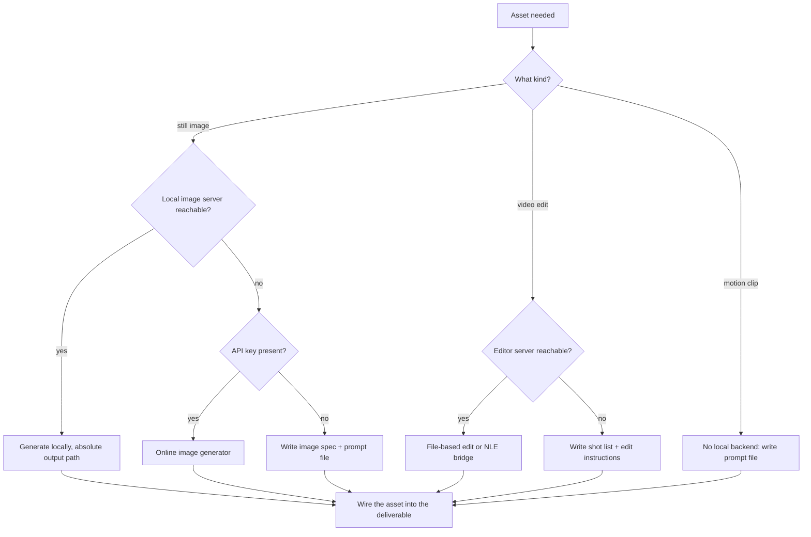

<!-- SPDX-License-Identifier: MIT -->

# Asset Routing

Offline-first. Try a local generator, fall back to an online one, and fall back
again to a written storyboard plus prompt file. Never block a campaign on an
unavailable backend — a campaign pack with executable prompts is a valid
deliverable.

## Decision tree

## Routing table

| Need | Preferred (offline) | Fallback (online) | Last resort |
|------|--------------------|--------------------|-------------|
| Thumbnail, hero, overlay | Local image-generation MCP server | Hosted image API via a documented script | Image spec plus prompt file |
| Short-form video edit | File-based video editor MCP, or an NLE bridge MCP | Manual edit instructions | Shot list with timecodes |
| Motion or B-roll clip | None generally available locally | Hosted video model where the user has access | Storyboard plus per-shot prompts |
| Voiceover | Local text-to-speech where installed | Hosted TTS with a key | Script marked for human read |
| Transcript, captions | Local speech-to-text | Hosted transcription | Manual caption pass |

Check availability before promising an asset. If a server is configured but
failing, say so plainly and route to the fallback in the same turn rather than
retrying blindly.

## Rules inherited from video and image tooling

These are the mistakes that actually break pipelines:

- **Confirm the bridge first.** For NLE-bridge servers, query connection status
  before any edit call. A silent failure mid-timeline is worse than an early stop.
- **Read the timeline before editing it.** Track count, frame rate, and duration
  determine every subsequent index.
- **Index conventions differ.** Some collections are 1-based and others 0-based
  within the same server. Read the bridge server's own documentation for its
  index base and its workspace model before any batch edit; do not assume.
- **Render is an ordered chain.** Settings, then format, then job creation, then
  start. Skipping a step produces a job that renders the wrong thing.
- **Paths cross OS boundaries.** When the agent runs in a Linux environment and
  the application runs on Windows, convert the path before passing it — a Linux
  path handed to a Windows application fails with an unhelpful error.
- **Inputs are never modified in place.** File-based operations write to a new
  output path; keep the original.

## Rules inherited from image generation

- **Gather context before generating.** Read one or two sibling assets from the
  destination folder and match their style, palette, and aspect ratio. Check the
  project's theme tokens and existing brand assets. An asset that does not look
  like it belongs is a failed asset regardless of its quality.
- **Size to the surface.** Square for avatars and icons, 9:16 for Reels and
  Shorts covers, wide for blog heroes and social cards.
- **Quality tier to purpose.** Fast and cheap for exploration, high only for the
  final ship-ready asset.
- **Surface errors, do not paper over them.** Missing credentials, unverified
  accounts, and invalid sizes get reported to the user verbatim. Do not silently
  switch models or degrade quality to make a call succeed.
- **Never read secrets from disk** to work around a missing key. Ask the user how
  they want to provide it.

## Wiring, not dumping

Writing the file is half the job. In the same turn:

- Blog hero → update the `image` field in the post frontmatter.
- Reel or Short overlay → record the path and its in/out timecodes in the shot
  list.
- Social card → update the Open Graph metadata reference.
- Carousel slide → add it to the ordered slide manifest.

Match the existing path convention in the project rather than inventing one.

## Default output location

Write generated assets under a campaign-scoped folder alongside the deliverables,
using descriptive filenames that encode the surface:
`<campaign-slug>/assets/<surface>-<description>.png`. Record every path in the
Assets table of the output so a later session can find them.
