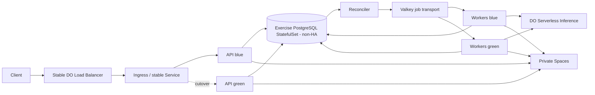

<!-- SPDX-License-Identifier: MIT -->

# DOKS exercise variant — constrained, not the Part 1 production default

**Status:** Decision fence only. Not approved, implemented, or deployed. Do not
build or apply its Terraform/Helm until an ADR-001 reopen trigger fires and a
named owner and budget are approved.

**Purpose:** Preserve the Kubernetes ideas from the planning discussion without
weakening [ADR-001](../decisions/ADR-001-part1-platform.md). The production
recommendation remains App Platform + managed PostgreSQL + managed Valkey +
private Spaces. This variant is suitable for a demonstration or a later reopen
of Option A; its single PostgreSQL pod is not an enterprise HA design.

## Notes translated into decisions

| Planning note | Safe interpretation | Decision / impact |
|---------------|---------------------|-------------------|
| Terraform creates Kubernetes | Terraform provisions DOKS, VPC, node pool, registry, DNS, and supported network controls | Keep as an Option A module; do not apply until budget and a Kubernetes owner are approved |
| One PostgreSQL pod | A single StatefulSet replica can demonstrate persistence | Exercise only; one pod has node/volume/upgrade downtime and no database failover |
| PostgreSQL persistent volume | Use a DOKS CSI `ReadWriteOnce` PVC | Survives pod replacement, not region loss, corruption, bad writes, or every cluster failure |
| Seven-day snapshots | Retain daily CSI volume snapshots for seven days | Supplemental recovery only; a volume snapshot is not automatically a PostgreSQL-consistent backup or PITR |
| Serverless concurrency 10; timeout four minutes | Treat 10 as a provisional application cap and 240 seconds as the hard inference-call timeout | Verify provider/account quota; load-test before raising; total worker attempt must remain below drain/lease limits |
| Valkey retry three times | Interpret literally as `JOB_MAX_RETRIES=3`: initial attempt plus at most three retries | PostgreSQL records every attempt; terminal outcome is `dead_letter` and the status API reports failure |
| Capacity scales as needed | Increase worker replicas while respecting inference cap, queue lag, memory, and budget | Scaling is evidence-driven; “can scale” is not capacity proof |
| Optimize time, certainty, bill | Prefer the lowest-complexity option that passes SLO/security/recovery gates | This still favors App Platform for Part 1; DOKS is justified only by a reopen trigger |
| One VPC / private database | Put DOKS nodes and managed data in one VPC where supported and restrict trusted sources | Preferred for production; Spaces still uses private ACL, scoped credentials, and TLS |
| Small Droplet for 2–10 jobs | A small CPU Droplet worker is another compute option | Defer for Part 1; it adds host lifecycle/security toil without solving the stated managed-platform need |
| Terraform blue-green | Terraform owns durable infrastructure; Helm/Kubernetes owns blue/green workloads | Keep one stable load balancer; switch Service/Ingress routing after health checks, then drain old workers |
| Valkey failure to block/object storage | PostgreSQL is the durable job ledger; Spaces holds PDFs and temporary signed access | Reject Volumes/Spaces as queue substitutes; reconcile Valkey from PostgreSQL |
| 24-hour rolling link | Generate a vendor-scoped Spaces presigned URL with default expiry 1 hour and hard maximum 24 hours | URL expiry is access control, not object retention or queue durability |

Provider capability and pricing must be verified immediately before purchase.
DigitalOcean documents [DOKS CSI volume snapshots](https://docs.digitalocean.com/products/kubernetes/how-to/create-snapshots/),
[volume restore](https://docs.digitalocean.com/products/kubernetes/how-to/restore-volumes/),
[DOKS load balancers](https://docs.digitalocean.com/products/kubernetes/how-to/add-load-balancers/),
[Spaces presigned URLs](https://docs.digitalocean.com/products/spaces/how-to/set-file-permissions/),
and [managed Valkey limits](https://docs.digitalocean.com/products/databases/valkey/details/limits/).

## Variant topology

For the exercise-only database variant, `pg` is a one-replica StatefulSet with a
DOKS CSI PVC. For a production Option A reopen, replace it with managed
PostgreSQL unless a named DBA/platform owner supplies and proves replication,
WAL archiving, backup/PITR, upgrades, failover, and restore operations.

## Terraform and workload ownership

Terraform owns:

- DOKS cluster, VPC, node pool, registry, DNS, and supported firewall/trusted
  source configuration;
- managed PostgreSQL/Valkey when using production Option A;
- private Spaces bucket and policy posture; key minting/rotation occurs through
  the approved secret bootstrap path, outside Terraform;
- stable load-balancer prerequisites and protected remote Terraform state.

If this option is reopened, keep the same two-part layout as the Part 1
baseline: reusable `modules/doks_platform` library plus thin
`environments/<name>` roots with separate state and approvals. Do not mix DOKS
and App Platform behind a single conditional mega-module.

Helm or versioned Kubernetes manifests own:

- API and worker Deployments, Services, Ingress, ConfigMaps, secret references,
  probes, resource requests/limits, disruption budgets, and network policies;
- blue/green labels and routing selectors;
- the exercise-only PostgreSQL StatefulSet, PVC, snapshot schedule, and restore
  test resources.

Terraform and Helm do not receive application JSON values. Before this option is
implemented, Security must select the external secret product and bootstrap
identity. Runtime JSON is projected into the minimum required pod, checked
against platform-controlled `APP_ENV`, parsed into typed secret wrappers, and
never written to a PVC, image, manifest, plan, state, or log. Plain Kubernetes
Secret YAML and base64 are not encryption.

Terraform must not recreate the load balancer for every application release.
Changing a stable Service/Ingress route avoids endpoint churn and separates
infrastructure lifecycle from workload promotion.

Network acceptance is fail-closed: DOKS nodes and managed databases share the
approved VPC, database/Valkey connections use verified private hostnames or
trusted sources, PostgreSQL has no public Kubernetes Service, and namespace
NetworkPolicies default-deny ingress and egress except DNS, private data
services, Spaces, inference, registry, and required observability endpoints.

## Exercise-only PostgreSQL pod

Minimum demonstration contract:

1. One PostgreSQL StatefulSet replica with a generated password from a protected
   secret store and no public Service.
2. One encrypted DOKS CSI `ReadWriteOnce` PVC with explicit storage request,
   retention policy, and resource limits.
3. NetworkPolicy permits database ingress only from API, worker, migration, and
   approved backup/restore pods.
4. Daily CSI snapshots retained for seven days.
5. A PostgreSQL-aware logical or base backup is written to private Spaces
   daily; CSI snapshots alone do not satisfy database consistency or PITR.
6. Restore into a new PVC/database, run integrity checks, and measure RPO/RTO.
7. Database schema changes use expand/contract migrations and run as a
   single-purpose Job before traffic cutover.

This topology remains `FAIL` for production HA because it has one database
process and one writable volume. Seven retained snapshots reduce some recovery
risk but do not change that availability conclusion. Its exercise recovery
target is at best RPO ≤24 hours until measured; it does **not** satisfy the
Part 1 planning baseline of RPO ≤15 minutes. Testing that baseline requires
continuous PostgreSQL WAL archival to private Spaces plus a timed point-in-time
restore drill.

Cost does not justify promoting this pod to production: DigitalOcean’s managed
PostgreSQL entry plan currently starts around $15/month for a non-HA 1 GiB
single node suitable for staging, while managed HA starts around $60/month for
a 2 GiB primary plus matching standby. The self-managed pod saves only visible
provider line items while adding database engineering and on-call ownership.

## Job, retry, and concurrency contract

- PostgreSQL remains authoritative for `accepted`, `quarantined`, `running`,
  `retry`, `succeeded`, and `dead_letter` state.
- Valkey carries opaque `job_id` values only. A queue outage pauses dispatch;
  the reconciler later re-enqueues eligible PostgreSQL jobs.
- `JOB_MAX_RETRIES=3`: the initial attempt plus at most three retries (four
  total attempts). Exhaustion
  transitions durably to `dead_letter`; the vendor-scoped status endpoint
  reports terminal failure and a correlation id.
- Create an immutable `job_attempts` row before each inference call. Retry only
  classified transient timeout, 429, and dependency failures with bounded
  exponential backoff and jitter; validation/authentication/terminal model
  errors dead-letter without consuming all retries.
- `INFERENCE_TIMEOUT_SECONDS=240` is the hard per-call limit.
- `INFERENCE_MAX_CONCURRENCY=10` is a provisional fleet-wide ceiling, not a
  verified provider quota. A PostgreSQL advisory-lock semaphore is the runtime
  authority across replicas/colors; a worker must acquire one of 10 slots before
  calling inference and releases it when the call ends. Deployment validation
  also rejects a planned replica × worker concurrency budget above 10.
- A worker attempt allows at most 240 seconds for simulated work plus 240
  seconds for inference plus 30 seconds for durable completion/shutdown = 510
  seconds. Use a 570-second lease and a 600-second termination grace.
- Scale replicas only when queue wait or arrival rate breaches the agreed
  threshold and the resulting fleet remains within provider quota and budget.

If actual inference quota differs, update the cap, capacity test, and cost model
together. Do not raise replicas independently and assume the provider will
accept the resulting concurrency.

## Blue-green release and job drain

1. Deploy green API and a zero-replica green worker Deployment using an
   immutable image digest.
2. Run schema migration Job using expand/contract changes only.
3. Prove green startup/readiness and a synthetic upload/status flow.
4. Switch the stable Service/Ingress selector from blue API to green API. The
   external load balancer and DNS remain unchanged.
5. Scale the blue worker Deployment to zero. Its SIGTERM handler stops new
   claims immediately and finishes or releases active leases within the
   600-second grace. Processing may pause briefly; jobs are not copied between
   pods.
6. Wait for `active_leases(deployment=blue)=0`, then scale green workers to the
   approved replica count. Reconcile expired leases from PostgreSQL and resume
   them idempotently. The runtime PostgreSQL semaphore prevents either color
   from exceeding the fleet-wide inference cap during rollback or overlap.
7. Delete blue only after API error/SLO checks pass and active blue leases reach
   zero. Retain the blue digest and manifests for rollback.
8. Roll back by restoring the prior API route and worker digest. Do not roll
   back a destructive database migration.

The load balancer routes API traffic; workers are queue consumers and are not
load-balanced as HTTP request targets.

## Valkey failure and private object access

Valkey failure does not fall back to a mounted volume or object-storage queue.
Those systems do not provide the claim, acknowledgement, retry, or coordination
semantics required here. The safe degraded mode is:

1. keep accepting only if PostgreSQL and private Spaces are healthy;
2. persist the job in PostgreSQL and return `202`;
3. alert that dispatch is paused;
4. reconcile eligible jobs to Valkey when service returns;
5. apply admission control if database backlog crosses the approved bound.

Spaces provides the DigitalOcean alternative to AWS S3 presigned URLs because
its API is S3-compatible. The API issues GET-only URLs with a default one-hour
expiry and a hard maximum of 24 hours after rechecking `vendor_id` ownership.
Objects stay private, URLs are not logged or placed in broad audit payloads, and
object retention is governed separately from URL expiry.

## Decision gates

Choose this DOKS variant only when all are true:

- an ADR-001 reopen trigger explicitly funds implementation; planning approval
  alone does not authorize a cluster or Droplet;
- a named platform owner accepts cluster upgrade, networking, backup, restore,
  release, and on-call runbooks;
- DOKS solves a measured need that App Platform cannot meet;
- current SKU, region, quota, and price are verified;
- clean-account provisioning, node loss, queue loss, restore, blue/green
  rollback, load, soak, and security-isolation evidence pass;
- production uses managed PostgreSQL or separately proves a genuine HA database
  design; the one-pod exercise database never receives a production waiver by
  implication.

