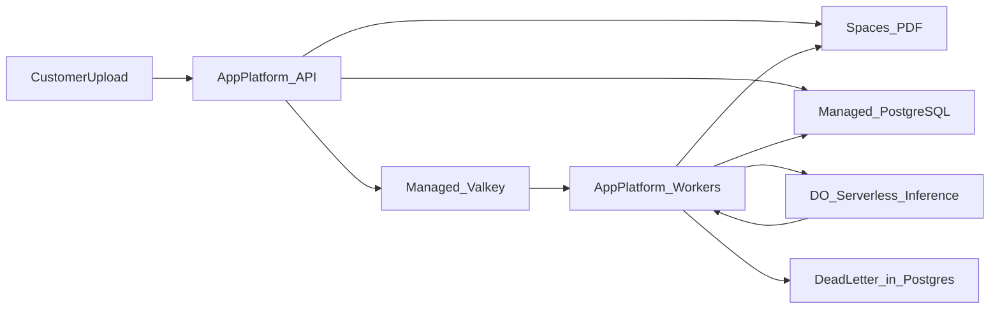
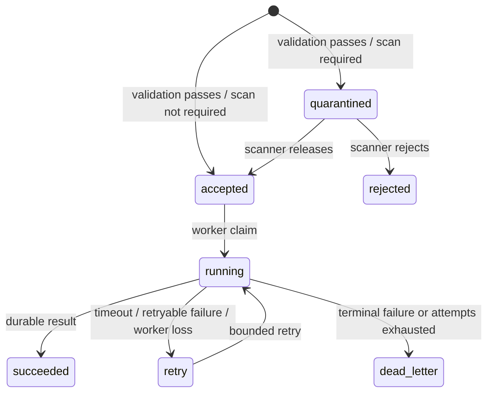

<!-- SPDX-License-Identifier: MIT -->

# Part 1 — Production platform architecture (design)

**Status:** Design scaffold. Not deployed. Awaiting Dana answers on checklist
and recovery envelope.

**Recommendation:** App Platform (API + workers) + managed PostgreSQL + managed
Valkey + Spaces. See [ADR-001](../decisions/ADR-001-part1-platform.md).

---

## 1. Plain-language summary

Halcyon should stop running the database, queue, API, and worker on one Droplet.
Upload accepts a PDF, stores it safely, records the job, and returns a job id.
Workers process contracts asynchronously, call DigitalOcean Serverless
Inference with timeouts, and never treat the queue as the only memory of a job.
Releases happen from CI and Terraform — not SSH at night.

---

## 2. Request and data path

1. Client uploads PDF to API.
2. API writes object to private Spaces.
3. API inserts the job in PostgreSQL as `accepted` when scanning is not required,
   or `quarantined` when scanning is required.
4. API enqueues the job id on Valkey only from `accepted`; a quarantined job is
   enqueued only after a scanner durably releases it to `accepted`.
5. Worker claims only `accepted`/`retry` jobs, loads PDF metadata/content as
   needed, sleeps randomly
   20s–4m in the **simulation**, calls `https://inference.do-ai.run` with a hard
   timeout, occasionally simulates hang/fail.
6. Worker writes result or failure/attempt to PostgreSQL; dead-letters after max
   attempts.
7. Client polls status by job id.

Inference product docs: https://docs.digitalocean.com/products/inference/

### Requirement-to-tool adaptation

| Primary requirement | Selected tool / pattern | Acceptance contract |
|---------------------|-------------------------|---------------------|
| File queue | Managed Valkey carrying only `job_id`; PostgreSQL remains authoritative | A lost/evicted queue entry is detected by reconciling PostgreSQL `accepted`/`retry` jobs and can be safely re-enqueued |
| Upload + vendor tag | FastAPI upload endpoint, private Spaces object, PostgreSQL `vendor_id` ownership | The authenticated vendor identity is server-derived; clients cannot select another vendor, and every object/job lookup is vendor-scoped |
| Upload security | PDF allowlist, file signature check, bounded bytes/pages, generated object key, private ACL, encrypted transport, malware-scan hook | Invalid, oversized, public, or cross-vendor access is rejected before enqueue; original filenames are metadata only |
| Serverless inference | One async `httpx` gateway client configured by `LLM_BASE_URL`, model, secret token, 240-second timeout, and provisional fleet cap of 10 in-flight calls | No direct provider calls outside the gateway module; secrets are masked, live calls are disabled in unit tests, and deployment configuration cannot exceed the cap |
| Timeout / failure simulation | Seeded fault policy with disabled-by-default rates for delay, timeout, and terminal failure | Tests select an explicit seed/outcome; production configuration cannot accidentally enable simulation |
| Asynchronous processing | App Platform worker component with bounded concurrency, idempotency key, three-retry ceiling, and PostgreSQL DLQ | Upload returns `202 + job_id`; duplicate delivery cannot duplicate a result; acknowledgement follows durable state; the initial attempt plus at most three retries ends in terminal `dead_letter` and the status API reports failure |

### Upload and tenancy boundary

The API derives `vendor_id` from the authenticated principal. It must not trust
`vendor_id`, object keys, or storage paths supplied in multipart fields. The
durable identity is `(vendor_id, job_id)` in PostgreSQL. Spaces objects use both
an opaque key prefix
(`vendors/<vendor_uuid>/jobs/<job_uuid>/source.pdf`) and Spaces object metadata
`vendor_id` / `job_id` for inspection and evidence. Ownership is never taken
from the client multipart form. The original filename is retained only as
sanitized metadata.

The simulation uses a lightweight validation boundary rather than pretending to
be a full document-security product:

1. authenticate and authorize the vendor;
2. stream to a bounded temporary buffer while hashing;
3. verify PDF content type and magic bytes; reject encrypted/unsupported input
   according to the agreed product policy;
4. write the private Spaces object under a generated job key, then create the
   PostgreSQL job row; compensate a failed row insert by deleting the object;
5. when scanning is not required, mark the job `accepted` and enqueue only its
   non-sensitive `job_id`;
6. when scanning is required, mark it `quarantined`; only a durable scanner
   release may move it to `accepted` and enqueue it.

An asynchronous malware-scanning stage is a cutover requirement when customer
security policy requires it. Local exercise and staging default to release
after the bounded validation above unless Dana requires scanning. An environment
that requires scanning fails closed when no scanner is configured, and
quarantined objects are never sent to inference.

Synchronous validation failures return an error before a durable job is created.
If compensating object deletion fails after a database error, a bounded sweeper
removes objects that have no matching job after the configured retention window.

### Job state and controlled faults

Fault injection is deterministic and off by default. Unit tests inject a fault
policy directly; staging may enable a seeded timeout/failure rate through
non-secret configuration. Production startup must reject non-zero simulation
rates unless an explicit staging-only environment guard is present.

### Simulation tooling: Locust, custom scripts, and app faults

Failure simulation and load generation are different jobs. Use three layers:

| Layer | Tool | Proves | Does not prove |
|-------|------|--------|----------------|
| Deterministic app faults | `halcyon_sim.faults` seeded policy + pytest | Timeout, hang, terminal failure, retry ceiling, DLQ, and production rejection of non-zero rates | Real worker death, Valkey loss, Spaces outage, deploy drain, or capacity |
| Client load / soak | Locust (preferred) or a thin HTTP client script | Arrival rate, p95 upload/status latency, queue wait under concurrency, capacity headroom, and soak stability | Infra faults; Locust cannot kill a worker, drop a Valkey key, or fail Spaces |
| Operational failure drills | Small `scripts/chaos/` helpers with `set -euo pipefail` | Worker kill/restart, queue-item removal, deploy-during-job, restore, and HA failover timelines | Application-rule determinism; keep these out of CI unit suites |

**Recommendation for this exercise:** keep the seeded fault module as the
source of truth for inference timeout/failure outcomes; use **Locust** for
staging load and soak; use **custom scripts** for the few platform failures
Locust cannot inject. Do not replace the fault policy with Locust random
errors—those are nondeterministic and weak evidence for retry/DLQ rules.

Locust constraints for this design:

1. Drive only public API paths (`upload`, `status`) with fixture PDFs bounded by
   `UPLOAD_MAX_BYTES`.
2. Authenticate as synthetic vendors; never use production credentials.
3. Cap concurrent uploads so the run stays within
   `INFERENCE_MAX_CONCURRENCY=10` and the approved prepaid inference budget.
4. Prefer paced status checks; do not treat 20s–4m job duration as an HTTP
   request failure.
5. Keep scenarios in `tests/load/` or `scripts/load/`; run them against staging
   only, outside the blocking unit-test CI job.

Custom failure-script constraints:

1. Target staging only; require an explicit `--env=staging` guard.
2. Prefer platform APIs (`doctl`/App Platform restart) over SSH.
3. Record before/after job ids, attempt history, and queue depth as evidence.
4. Never delete Spaces objects or database rows as a “chaos” action for the
   exercise; those destroy the ledger and orphan evidence.

### Exercise assumptions, considerations, and impact

The following are **provisional exercise defaults**, not customer-approved facts.
They let implementation design proceed without hiding unresolved risk. Each
default is conservative and reversible; the linked assumption log remains the
source of ownership and validation dates.

| Area / assumption | Consideration | Exercise default | Confidence | Impact if wrong | Control and reopen trigger |
|-------------------|---------------|------------------|------------|-----------------|----------------------------|
| Team operations ([A-TEAM-01](../client/assumption-log.md#a-team-01--prefer-managed-services-no-infra-specialist)) | Three engineers and no production Kubernetes owner cannot safely absorb host, database, and cluster operations during a six-week delivery | Use App Platform and managed data services; do not place Part 1 on the existing DOKS cluster | High | A newly assigned platform owner could make DOKS viable, but changing now adds schedule and operational risk | Revisit only when a named, experienced platform owner accepts the on-call and recovery runbooks |
| Workload ([A-WORK-02](../client/assumption-log.md#a-work-02--sizing-is-provisional-until-measured)) | “Thousands” does not define arrival rate, burst, PDF size, or inference latency | Start staging with 2 API instances, 2 workers, concurrency 2 per worker, 25 MiB upload cap, and a provisional fleet ceiling of 10 inference calls; treat all values as test inputs | High that sizing is provisional | Queue wait, worker memory, provider quota, and cost may miss targets | Verify account quota; load-test measured p95 PDF size and peak arrivals; resize without exceeding the approved cap |
| Inference limits ([A-WORK-04](../client/assumption-log.md#a-work-04--inference-limits-are-provisional-exercise-caps)) | The proposed concurrency, timeout, and retry values are planning constraints, not verified provider capabilities | Cap in-flight inference at 10, timeout calls at 240 seconds, and allow at most three retries after the initial attempt | Medium | Lower quota causes throttling/backlog; longer calls can exceed drain/lease budgets | Verify account quota and run load, timeout, and DLQ evidence before production approval |
| Recovery ([A-REL-01](../client/assumption-log.md#a-rel-01--conservative-recovery-envelope-is-a-planning-baseline-only)) | No approved customer RPO/RTO exists | Design for RPO ≤15 minutes and RTO ≤60 minutes for job metadata; do not publish this as an SLA | Medium | Stricter targets can require different database sizing, retention, drills, or architecture | Block cutover until Dana/CTO approve targets and a restore drill passes |
| Cost ([A-BUDGET-01](../client/assumption-log.md#a-budget-01--part-1-vs-part-2-money-are-separate)) | Current ~$400/month spend is observed pilot cost, not an approved production ceiling | Keep the platform planning band at ~$360–750/month excluding inference; create no paid resource until a ceiling is approved | Medium | A lower ceiling removes HA/headroom; a higher ceiling may permit stronger isolation | Re-estimate using current provider pricing and measured load before `terraform apply` |
| Identity ([A-DATA-05](../client/assumption-log.md#a-data-05--vendor-identity-is-an-authorization-boundary)) | The identity provider and enterprise SSO contract are unknown, but tenant isolation cannot wait | Define an authentication adapter that yields a server-derived immutable `vendor_id`; use a deterministic fake issuer only in tests/local exercise mode | High direction; Medium provider | Provider claims or delegated administration may change token validation and authorization rules | Keep provider code behind the adapter; reopen when Dana selects the identity provider |
| Upload security ([A-DATA-06](../client/assumption-log.md#a-data-06--upload-validation-precedes-inference)) | Malware scanner, encrypted-PDF policy, retention, and quarantine release policy are unresolved | Validate bounded PDF bytes/type/signature and store privately; quarantine only where scanning policy requires it, with no inference before durable release | Medium | Production cannot process uploads if policy requires a scanner that is not integrated | Add a scanner adapter and release transition; scanning-required environments fail closed when no scanner is configured |
| Data location and encryption ([A-DATA-01](../client/assumption-log.md#a-data-01--spaces-holds-pdfs)) | Region, residency, retention, and customer-managed-key requirements are unknown | Parameterize region and retention; require TLS and provider-managed encryption; never promise CMK support | Medium-High | A hard residency or CMK requirement could force another storage/service design | Validate provider capability and customer policy before selecting a region or applying IaC |
| Temporary object access ([A-DATA-07](../client/assumption-log.md#a-data-07--twenty-four-hours-limits-signed-access-not-retention)) | Clients may need time-bounded private access without proxying PDF bytes through the API | Issue vendor-authorized, GET-only Spaces presigned URLs with one-hour default and 24-hour maximum; keep object retention separate | Medium | Leaked URLs grant access until expiry; confusing URL and object retention can retain or delete data incorrectly | Never log URLs; recheck ownership before signing; confirm retention separately |
| Queue durability ([A-DATA-03](../client/assumption-log.md#a-data-03--valkey-is-a-queue-not-the-archive)) | Managed Valkey has no backup/restore and enqueue can fail after the database commit | PostgreSQL is authoritative; commit `accepted` first, enqueue `job_id` second, and reconcile missing/stale work idempotently | High | Treating Valkey as the ledger can repeat the prior job-loss class | Queue-loss and reconciliation tests must pass before staging approval |
| Incident forensics ([A-DATA-04](../client/assumption-log.md#a-data-04--root-cause-of-the-40-lost-jobs-is-unknown-until-reconstructed)) | The prior loss could have occurred in storage, database, queue, worker, or deployment paths | Design for each plausible failure without claiming a root-cause fix | High that cause is unknown | Evidence may require reprioritizing controls or migration sequencing | Reopen after the incident timeline workshop and update tests against proven failure points |
| Failure simulation ([A-WORK-03](../client/assumption-log.md#a-work-03--failure-simulation-is-deterministic-and-non-production)) | Exercise faults are useful evidence but dangerous in production; load tools and fault injectors solve different problems | Seeded injected outcomes in unit tests/staging only; Locust for staging load/soak; custom staging scripts for worker kill and queue loss; production startup rejects non-zero fault rates | High | Accidental production faults cause avoidable customer impact; Locust-only evidence misses retry/DLQ and infra failures | Configuration validation is a blocking unit/deployment gate; Locust and chaos scripts stay outside unit CI |
| Provider availability | DigitalOcean regions, SKUs, quotas, features, and prices can change | Keep resource sizes and region variable; mark availability and pricing unverified until checked immediately before purchase | Medium | A selected SKU/region may be unavailable or materially more expensive | Verify authoritative provider data, quota, and a clean-account plan before approval |

### Implementation design derived from the defaults

This design keeps uncertainty at replaceable boundaries. It defines the
post-approval implementation contract; it does not authorize cloud spend or a
production-ready claim. Before PR 1 merges, Dana/CTO must record owners and
decisions for identity, RPO/RTO, budget, and upload-security policy, or approve
a named, expiring risk acceptance.

#### Application boundaries

| Component | Responsibility | Safety contract |
|-----------|----------------|-----------------|
| `api` | Authenticate, stream/hash/validate upload, create private object and job, return `202`, expose vendor-scoped status | Never accepts client ownership or object keys; never waits for inference |
| `auth` | Convert a validated principal into immutable `vendor_id` | Fake issuer is permitted only for `APP_ENV=local`; all other environments reject fake auth; authorization queries always include `vendor_id` |
| `storage` | Private Spaces object operations through an async-safe adapter | Generated key only; private ACL + scoped credentials + TLS; bounded temporary storage; metadata never grants authorization; compensate or sweep orphan objects |
| `jobs` | PostgreSQL repository and state-transition service | Conditional transitions, attempt history, lease expiry, idempotency key, and durable DLQ; only `accepted`/`retry` may be claimed |
| `queue` | Enqueue/claim opaque `job_id` values and reconcile from PostgreSQL | Payload contains no PDF, token, result, or vendor-controlled path; queue loss is recoverable |
| `worker` | Claim leased `accepted`/`retry` work, fetch its input, invoke inference, persist outcome, acknowledge | `quarantined` is never leased, enqueued, or read for inference; bounded concurrency; durable state precedes acknowledgement; SIGTERM drains or releases lease |
| `inference` | One async OpenAI-compatible client | Explicit timeout, classified retries, PostgreSQL advisory-lock semaphore capped at 10 across all replicas/releases, secret unwrapped only at I/O, no prompt/body logging |
| `faults` | Select deterministic delay/timeout/failure outcome | Dependency-injected; zero-rate default; production guard rejects enabled simulation |
| `config` | Validate environment and wrap secrets | Fail closed on unsafe production combinations; structured JSON logging excludes secrets and PII |

The initial PostgreSQL model uses `jobs` for current state and immutable
`job_attempts` for audit/debug history. A worker claims a job with an atomic
conditional update and lease expiry. A stable idempotency key prevents duplicate
results when delivery repeats. It writes an attempt row before inference,
retries only classified transient failures with bounded backoff/jitter, and
dead-letters terminal failures or retry exhaustion. Before inference, every
worker must acquire one of 10 PostgreSQL advisory-lock slots; this runtime
semaphore keeps rolling old/new replicas within the fleet cap. Reconciliation
periodically selects committed
`accepted`/`retry` jobs that are not currently leased and re-enqueues them; it
never infers completion from queue absence. Provisional per-attempt limits are
240 seconds simulated work + 240 seconds inference timeout + 30 seconds durable
completion/shutdown budget = 510 seconds, below the 600-second termination
grace. Use a 570-second lease, reconcile every 60 seconds, and cap each
reconciliation batch at 100 jobs until load tests justify changes.

#### Infrastructure and environment boundaries

1. Split Terraform into reusable modules under `infra/terraform/modules/` and
   thin environment roots under `infra/terraform/environments/`. Staging and
   production call the same `part1_foundation` composition module but use separate
   backend keys, state, plans, approvals, and non-secret variable sets. Local
   tests use fakes; CI makes no live service calls.
2. Pin Terraform and provider/module versions. Before production, attach App
   Platform to the approved VPC, restrict managed PostgreSQL/Valkey trusted
   sources to that application path, and verify the application uses private
   platform bindables. Terraform owns those controls, managed data, private
   Spaces bucket, and registry. A separate versioned App Spec deployment job
   owns the App Platform API/worker definition and secret values so Terraform
   and the deploy pipeline do not fight over the same application.
3. Terraform state may contain provider-generated database credentials even
   when marked sensitive; keep it encrypted, locked, versioned, audited, and
   separately access-controlled per environment. Application Spaces/inference
   JSON never enters Terraform variables, plans, state, outputs, or source.
   Protected CI injects one scoped JSON secret per integration as App Platform
   `SECRET` environment values and performs rotation/restart. JSON is a format,
   not encryption. The app trusts platform-controlled `APP_ENV`, validates JSON
   agreement, parses once into typed secret wrappers, never persists it to a
   volume, and fails closed on malformed or wrong-environment data. API does not
   receive inference, provisioning, or other worker-only credentials.
4. Build one multi-stage, non-root image with separate
   `python -m halcyon_sim.api` and `python -m halcyon_sim.worker` entry points.
   Promote by image digest and retain the last known-good digest.
5. Configure API readiness separately from dependency diagnostics. Workers use
   startup checks, bounded concurrency, and a 600-second termination grace
   during the exercise until measured job duration proves a smaller value safe.
6. Emit structured JSON logs and low-cardinality metrics for job state, queue
   lag, attempt result, timeout, reconciliation, upload rejection, worker drain,
   dependency health, and authorization denial. Allow opaque `vendor_id` and
   `job_id` for audit correlation under retention/access controls; never emit
   document content, filenames, tokens, email addresses, or free-text PII.
7. Promote the API and worker together by immutable digest. Retain at least the
   current and previous known-good digests and App Specs. Database changes use
   expand/contract migrations so the previous image remains compatible.
   Engineering owns rollback; staging must prove restoration of the previous
   digest and configuration within 15 minutes before production approval.

#### Delivery sequence and review budget

After the approval gate above, keep each change independently reviewable under
the repository PR budget:

1. **PR 1 — package, blocking CI, and pure domain rules:** Python 3.12,
   `pyproject.toml`, typed settings, job states, fault policy, and direct unit
   tests. Remove soft-fail skips for every touched path before merge.
2. **PR 2 — adapters:** PostgreSQL, Valkey, Spaces, and inference interfaces
   with mocked contract tests; no live credentials.
3. **PR 3 — API and worker:** upload/status transport, leased worker loop,
   idempotency, reconciliation, graceful shutdown, and failure-path tests.
4. **PR 4 — image and full CI/security matrix:** multi-stage Dockerfile;
   SHA-pinned actions;
   lint, strict typing, unit tests with ≥80% changed-code coverage, secret,
   dependency, license, IaC, and image scans.
5. **PR 5 — Terraform and App Spec (budget/RPO approval required):**
   parameterized staging resources, protected state, least-privilege secret
   wiring, health checks, alerts, and plan review.
6. **PR 6 — staging evidence and runbooks:** load/soak, worker kill, queue loss,
   timeout/DLQ, vendor isolation, rolling rollback, restore, cost, and headroom.

Each PR must pass its applicable local gates before merge. Production remains
blocked until all applicable gates in the
[evidence pack](../evidence/README.md) are `PASS`, or a named and expiring risk
acceptance records owner, blast radius, and compensating control.

---

## 3. What we reject

| Pattern | Why |
|---------|-----|
| Single Droplet Compose (current) | Shared memory fate; SSH deploys; already lost jobs |
| Postgres/Valkey inside DOKS for Part 1 | DIY HA/backup/restore under enterprise deadline |
| One PostgreSQL pod + PVC + seven CSI snapshots as “HA/backup” | One process is not HA, and crash-consistent volume copies do not by themselves provide PostgreSQL-consistent backup or PITR |
| Valkey fallback to Block Storage or Spaces | Volumes and object storage do not provide queue claim/acknowledgement semantics; PostgreSQL already provides the durable reconciliation ledger |
| Terraform-managed load-balancer replacement per release | Creates avoidable endpoint/state churn; DOKS blue/green should retain one load balancer and switch a stable Service/Ingress |
| Synchronous HTTP extraction | Conflicts with long jobs and App Platform request limits |
| Valkey as sole job store | No backup/restore on managed Valkey — [limits](https://docs.digitalocean.com/products/databases/valkey/details/limits/) |

The detailed [DOKS exercise variant](doks-exercise-variant.md) preserves the
Kubernetes, single-pod database, small-Droplet, and blue/green ideas with
explicit non-production boundaries and decision gates.

---

## 4. Cost envelope (platform only — verify before buy)

Prices change; treat the following as **order-of-magnitude** planning inputs as
of research dated 2026-08, not a quote.

| Component | Example sizing intent | Rough monthly | Source |
|-----------|----------------------|---------------|--------|
| App Platform API | ≥2 dedicated small instances | tens of USD × count | [App Platform pricing](https://docs.digitalocean.com/products/app-platform/details/pricing/) |
| App Platform workers | ≥2–4 memory-friendly instances | tens of USD × count | same |
| Managed PostgreSQL staging | 1 GiB shared, single node | from **$15**; not HA, provider recommends dev/test | [PostgreSQL pricing](https://docs.digitalocean.com/products/databases/postgresql/details/pricing/) |
| Managed PostgreSQL production | 2 GiB primary + ≥1 matching standby | from roughly **$60** total ($30 + $30) before extras | same |
| Managed Valkey HA | Small HA | from ~$30+/node class | [Valkey pricing](https://docs.digitalocean.com/products/databases/valkey/details/pricing/) |
| Spaces | Private bucket | from $5 + usage | [Spaces pricing](https://docs.digitalocean.com/products/spaces/details/pricing/) |
| Container Registry | Basic | from $5 | [DOCR pricing](https://docs.digitalocean.com/products/container-registry/details/pricing/) |
| **Ensemble planning band** | Base production | **~$360–750/mo** | Excludes inference tokens |

The production floor is calculated from **2 API instances + 2 workers +
managed PostgreSQL HA (≥~$60) + managed Valkey HA + Spaces (≥~$5) + registry
(≥~$5) + network/observability usage**. The ~$15 staging database is additive
when staging remains online; it never replaces the ~$60 HA database in the
production sum. Exact App Platform, Valkey, network, and telemetry SKUs must be
quoted before treating the prior ~$360 floor as approved arithmetic.

The $360 lower bound is a provisional floor-SKU sum, not a claim that production
will cost less than the current pilot. Measured capacity, HA choices, and current
provider pricing determine the approved baseline.

The $15 managed PostgreSQL plan is the staging/default exercise cost lever, not
the enterprise production topology. Production retains managed HA because a
self-managed pod or Droplet would shift patching, replication, WAL, backup,
restore, failover, monitoring, and on-call work onto the same small team. See
the [managed-versus-self-managed comparison](tradeoffs-compute-platform.md#managed-postgresql-entry-tier-versus-self-managed).

**Inference tokens** are prepaid and usage-based — see
[Inference pricing](https://docs.digitalocean.com/products/inference/details/pricing/)
and [prepayment](https://docs.digitalocean.com/products/inference/how-to/manage-serverless-inference-prepayment/).
Exercise credits (~$200) may not cover migration load; stop and escalate before
personal spend.

**Budget framing for Dana:** today’s ~$400 is observed pilot spend. Production
adds isolation and durability. We will not propose an unexplained 10× (~$4,000)
jump; every increment maps to a risk removed. Confirm ceiling in checklist §D.

---

## 5. Failure modes

| Failure | Detect | Mitigate | Prevent |
|---------|--------|----------|---------|
| Worker OOM on large PDF | Restart metrics, OOM logs | Isolate workers from API; bound concurrency | Memory limits; size by PDF percentiles |
| Inference hang | Client timeout metric | Fail attempt; retry with jitter; DLQ after the initial attempt plus at most three retries | Hard `INFERENCE_TIMEOUT_SECONDS=240` |
| Inference concurrency / quota / prepaid empty | In-flight gauge, queue wait, 429 / auth errors | Hold at fleet cap 10, pause/pace intake, alert, top up prepaid | Verify quota; deployment cap; budget alerts |
| Valkey key loss / restart | Queue depth vs Postgres `accepted`/`retry` lag | Reconcile from Postgres; requeue; report terminal failure only after job attempt ceiling | Postgres is ledger; never substitute Volumes/Spaces for queue durability |
| Deploy kills long job | Incomplete jobs after release | Grace period ≤600s; requeue on SIGTERM | Test deploy-during-job |
| Postgres primary failover | Connection errors | App retries with backoff | Managed HA; connection pooling |
| Spaces unavailable | Upload errors | Fail upload clearly; no silent accept | Health dependency checks |
| Object written but job insert fails | Database error plus unreferenced-object sweep metric | Attempt compensating delete; quarantine until bounded sweeper removes it | Generated job key; short orphan-retention window; failure-path test |
| Cross-vendor object access | Authorization-denial audit metric | Deny request; alert on repeated attempts | Server-derived `vendor_id`; scoped queries and opaque keys |
| Malicious or malformed upload | Validation/scanner rejection metric | Quarantine or reject before inference | Size/signature policy; private bucket; malware-scan gate |
| Simulation enabled in production | Startup configuration error / deployment check | Refuse startup or force rates to zero | Environment guard plus CI configuration test |

---

## 6. Delivery (replace SSH)

| Step | Tooling |
|------|---------|
| Provision foundations | Terraform (`part1_foundation`: network/project, managed databases, Spaces bucket/policy, registry); state is protected as secret-bearing |
| Build | CI: ruff, mypy, pytest, bandit/pip-audit, docker build |
| Deploy app | Secure CI pushes the digest to DOCR, resolves Terraform’s non-secret outputs/bindables, injects scoped App Platform `SECRET` JSON, and promotes the versioned App Spec |
| Prove | Health checks, rolling deploy, rollback |

Kubernetes/Helm is **not** the Part 1 default (assumption A-DELIVERY-04).
Part 1 uses immutable rolling promotion with worker drain/requeue. If a DOKS
reopen trigger fires, Terraform provisions durable infrastructure while
Helm/manifests perform blue/green behind one stable load balancer; old workers
drain PostgreSQL leases rather than migrating in-memory jobs.

---

## 7. Deliberate omissions

- Service mesh, multi-region active-active
- Kafka / dedicated queue product
- Real contract parser / OCR quality work
- GPUs in Part 1
- Production DOKS adoption
- DIY production PostgreSQL on DOKS
- Terraform-driven replacement of the load balancer for each release
- Full observability SaaS (start with DO metrics + structured JSON logs)
- Customer-managed keys until checklist §E demands them

Omissions are intentional for a one-day FDE budget and a three-engineer team.

---

## 8. Six-week plan for Dana

| Week | Focus |
|------|-------|
| 0 (now) | Answer [clarification checklist](../client/clarification-checklist.md); choose RPO/RTO envelope; confirm Part 1 budget ceiling |
| 1 | After approval gate: PR 1–2 package/domain rules, blocking CI, and mocked adapters |
| 2 | PR 3–5 API/worker, image, reviewed Terraform plan, and staging environment from a clean account |
| 3 | Load / paced migration rehearsal with synthetic thousands |
| 4 | PR 6 failure evidence: worker kill/retry, queue loss, rolling rollback, restore, alerts, DLQ runbook, and inference prepaid monitoring |
| 5 | Enterprise cutover plan + freeze; keep rollback image |
| 6 | Migration support window; temporary worker scale only within the runtime inference semaphore, verified provider quota, and approved budget |

---

## 9. Open questions blocking “production-ready”

See checklist §§A–E. Without arrival rates, forensics on the 40 jobs, RPO/RTO,
and budget ceiling, this document remains a **design**, not a go-live certificate.

Production readiness also requires binary evidence for load, soak, rollback,
dependency failure, restore, security isolation, and capacity headroom. Missing
evidence is a **FAIL**, not “not tested”; see the
[evidence pack](../evidence/README.md).

Next implementation stubs: [../../infra/terraform/README.md](../../infra/terraform/README.md),
[../../app/README.md](../../app/README.md).
