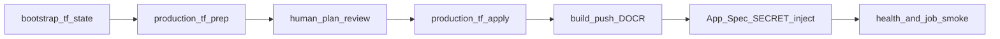

<!-- SPDX-License-Identifier: MIT -->

# Production preparation (foundations + App Platform)

**Scope:** Unblock production *prep* using assumption-log defaults. This runbook
does **not** claim the seven evidence gates PASS, and it does **not** authorize
unattended `terraform apply`.

Compute is **App Platform** (ADR-001), not Droplets. Terraform owns VPC,
managed PostgreSQL/Valkey (HA), Spaces, and DOCR only.

## Prep-authorized assumptions

| ID | Assumed default | Reopen when |
|----|-----------------|-------------|
| A-REL-01 | RPO ≤15 min / RTO ≤60 min planning envelope | Dana publishes SLA text |
| A-BUDGET-01 | Stay inside ~$360–750/mo platform band excl. inference | CTO sets a hard ceiling |
| A-WORK-02 / A-WORK-04 | 2 API + 2 workers; inference concurrency 10 / 240s timeout / 3 retries | Measured traffic or quota differs |
| A-DATA-05 | `AUTH_MODE=fail_closed`; no FakeAuth in production | Identity provider chosen |
| A-DATA-06 | `UPLOAD_SCAN_REQUIRED=false` until §E | Security mandates a scanner |
| A-DELIVERY-01 | Spaces remote state + `use_lockfile` (Terraform ≥1.10) | Org mandates HCP Terraform |

Staging remains the functional smoke environment. Production apply waits on a
reviewed plan plus human `CONFIRM_PRODUCTION_APPLY=yes`.

## Sequence



1. **Bootstrap remote state** (once per account):

   Run the bootstrap from WSL. It verifies the active `doctl` context, creates a
   full-access Spaces key with `doctl` when credentials are not already
   exported, persists the one-time secret under `$HOME`, and uses the official
   DigitalOcean Terraform provider to create the state bucket:

   ```bash
   bash scripts/bootstrap_tf_state.sh
   source ~/halcyon-tfstate-backend.env
   ```

   Creates Spaces bucket `halcyon-part1-tfstate`, enables versioning, and writes
   the credential env file under `$HOME` (gitignored). The bootstrap bucket uses
   isolated local Terraform state with `prevent_destroy`; production and staging
   workload state then live remotely in that bucket. No AWS CLI or SDK is used.

2. **Plan production foundations** (no apply):

   ```bash
   bash scripts/production_tf_prep.sh
   ```

   Writes gitignored `production.tfvars`, runs `terraform init` with
   [`backend.hcl`](../../infra/terraform/environments/production/backend.hcl),
   validates, and emits `tfplan`.

3. **Human review** — confirm SKUs, unique bucket/registry names, spend, and
   that no application JSON secrets appear in the plan.

4. **Apply only after explicit confirmation**:

   ```bash
   CONFIRM_PRODUCTION_APPLY=yes bash scripts/production_tf_apply.sh
   ```

5. **Fill** [`deploy/production.nonsecret.env.example`](../../deploy/production.nonsecret.env.example)
   from `terraform output` / `doctl`, inject `DATABASE_URL`, `VALKEY_URL`,
   `SPACES_CREDENTIALS_JSON`, and `LLM_CREDENTIALS_JSON` as App Platform
   `SECRET`s (see [secret-rotation.md](secret-rotation.md)).

6. **Build/push** the image to the production DOCR, then
   `doctl apps create|update --spec` from
   [`deploy/app-spec.production.yaml`](../../deploy/app-spec.production.yaml).
   Append managed-database firewall trust for `app:<app-id>`.

7. **Smoke** `/healthz` and one authenticated contract upload/status path.
   Evidence gates in [`docs/evidence/README.md`](../evidence/README.md) remain
   FAIL until captured.

## Credential wiring

Everything is DigitalOcean. You export exactly two DigitalOcean credentials —
an API token and one Spaces access key — and the scripts fan them out to the
variable names each tool expects.

| Channel | Variables | Source |
|---------|-----------|--------|
| DigitalOcean provider | `DIGITALOCEAN_TOKEN` | DO API token |
| Spaces provider (bucket resources) | `TF_VAR_spaces_access_id`, `TF_VAR_spaces_secret_key` | Spaces key |
| Terraform remote state backend | `AWS_ACCESS_KEY_ID`, `AWS_SECRET_ACCESS_KEY` | same Spaces key |
| App runtime | App Platform `SECRET` envs only — never `-var` / `.tfvars` | protected channel |

### Why the state backend uses `AWS_*` names

Spaces is S3-compatible, and DigitalOcean's own
[Terraform backend guide](https://docs.digitalocean.com/products/spaces/reference/terraform-backend/)
uses Terraform's `s3` backend against a Spaces endpoint. That backend reads
credentials from the `AWS_*` environment variables because those names belong to
the S3 protocol implementation, not to any account: the values are DigitalOcean
Spaces keys, requests go only to `nyc3.digitaloceanspaces.com`, and no AWS
account, API call, or charge is involved. `AWS_EC2_METADATA_DISABLED=true` is set
so the backend never probes AWS metadata endpoints. Terraform has no
DigitalOcean-native state backend, so this is the DigitalOcean-only option short
of paying for HCP Terraform.

## Known topology gap

App Platform region slug `nyc` maps to **nyc1**; managed data defaults to
**nyc3**, so the app is not VPC-attached (same as staging). Databases trust the
App Platform app id via firewall rules and public TLS hosts until a same-region
attachment is available.

## Still blocked for “production-ready”

- Seven live evidence gates (load, soak, rollback, dependency, restore,
  security, capacity)
- Hard cost ceiling and enterprise SLA text from Dana/CTO
- Identity provider selection beyond the fail-closed adapter
- Staging auth/inference still on local/fake for smoke — must not copy to
  production
