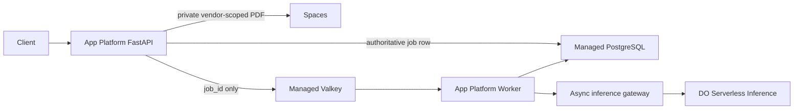

<!-- SPDX-License-Identifier: MIT -->

# Halcyon AI Infrastructure — Executive Briefing | 2026-08-15

> **Superseded for submission status:** staging smoke and the simulated app are
> live as of 2026-08-17. Use
> [dana-recommendation.md](../../docs/recommendation/dana-recommendation.md),
> [access.md](../../docs/evidence/access.md), and the root README for current
> state. Production evidence gates remain FAIL.

## Three-bullet summary

- 🟡 **Halcyon Part 1 is at risk** — all **5 primary requirements** map to
  named services and controls, but **7/7 production-readiness gates remain
  FAIL** because implementation and live evidence have not started.
- **Completed the architecture adaptation** — secure vendor-scoped uploads,
  durable PostgreSQL job state, recoverable Valkey transport, asynchronous App
  Platform workers, and deterministic inference fault testing now form one
  coherent delivery design.
- ⚠️ **Decision needed by 2026-08-22** — Dana and the CTO must approve RPO/RTO
  and the Part 1 cost ceiling; Dana and Security must confirm identity,
  quarantine/scanning, retention, and encryption requirements.

## Key wins

- Selected one low-operations stack: App Platform + private Spaces + managed
  PostgreSQL + managed Valkey + DigitalOcean Serverless Inference.
- Converted timeout, worker loss, queue loss, malformed upload, and cross-vendor
  access into explicit detect/mitigate/prevent controls and evidence criteria.

## Risks and decisions

- Traffic shape and PDF size percentiles are unknown, so worker count, queue
  limits, migration duration, and final cost are not defensible.
- The prior forty-job loss has not been reconstructed; the new design survives
  plausible failure points, but root-cause claims remain unsupported.
- Malware scanning is conditional on customer policy. Until selected and
  evidenced, uploads requiring scanning must remain quarantined.

## Next two weeks

1. By **2026-08-22**, close the client checklist, approve ADR-001, and lock
   recovery, budget, identity, and data-handling decisions.
2. Implement the secure asynchronous simulation and Terraform/App Spec with
   deterministic unit tests and no live-service calls in CI.
3. Produce staging evidence for upload isolation, queue reconciliation,
   timeout/DLQ behavior, worker loss, rollback, restore, load, and headroom.

## Recommended architecture

## Executive ask

Approve **Option B** as the proposed Part 1 architecture and assign owners to
close the blocking decisions. Do not authorize a production-ready claim until
all seven evidence gates pass or a named, expiring risk acceptance documents
the blast radius and compensating control.

## Sources

- [Dana recommendation](../../docs/recommendation/dana-recommendation.md)
- [Part 1 architecture](../../docs/architecture/part1-production-platform.md)
- [ADR-001](../../docs/decisions/ADR-001-part1-platform.md)
- [Assumption log](../../docs/client/assumption-log.md)
- [Evidence gates](../../docs/evidence/README.md)
- [Memory decision](../../.ai/memory/semantic/mem-2026-08-15-part1-managed-async-architecture.md)
